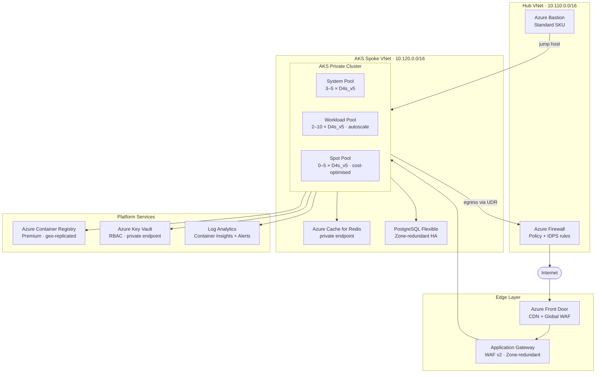

# azure-aks-platform

Production-ready Azure AKS landing zone built with Terraform — modular, private, and secure by default.

This repository is a public reference implementation of how I would structure an Azure platform for Kubernetes workloads at scale (~10k users), covering edge security, private networking, managed data services, observability, and cost optimization.

No live Azure credentials, subscription IDs, tenant IDs, or secrets are included.

## Architecture



## What This Repository Demonstrates

- **Hub-spoke networking** with Azure Firewall for controlled egress (`userDefinedRouting`)
- **Private AKS cluster** — API server not reachable from the public internet
- **Edge security** — Azure Front Door (global WAF + CDN) → Application Gateway WAF v2
- **Zero-secret identity** — OIDC issuer, Workload Identity, user-assigned managed identities
- **Managed data layer** — Azure Cache for Redis and PostgreSQL Flexible Server, both VNet-integrated
- **Private endpoints** for ACR, Key Vault, and Redis with Private DNS auto-registration
- **Multi-pool AKS** — system, workload, and spot pools; all autoscaling
- **Observability** — Container Insights, Log Analytics, metric alerts (CPU/memory), diagnostic logs for Firewall, App Gateway, and Key Vault
- **Secure jump access** — Azure Bastion with correct NSG rules
- **GitOps-ready Kubernetes** — namespaces, network policies, RBAC, HPA examples
- **Multi-environment** — `dev` and `prod` compositions with separate state

## Repository Layout

```
.
├── modules/
│   ├── aks/               AKS cluster, multi-pool, autoscaling, Defender, Workload Identity
│   ├── acr/               Azure Container Registry (Premium, geo-replicated)
│   ├── app-gateway/       Application Gateway WAF v2, zone-redundant, AGIC-ready
│   ├── bastion/           Azure Bastion + mandatory NSG rules
│   ├── firewall/          Azure Firewall, policy, egress rules, route table
│   ├── front-door/        Azure Front Door Standard, WAF, origin group
│   ├── identity/          User-assigned managed identity
│   ├── key-vault/         Key Vault, RBAC, private endpoint, diagnostic logs
│   ├── monitoring/        Log Analytics, Container Insights, alerts, action group
│   ├── network/           VNet, subnets (delegation + skip_nsg), NSGs, peering
│   ├── postgresql/        PostgreSQL Flexible Server, Zone-redundant HA, AAD auth
│   ├── private-dns/       Private DNS zones + VNet links (cartesian product)
│   ├── redis/             Azure Cache for Redis, private endpoint
│   ├── resource-group/    Resource group
│   └── role-assignment/   Azure RBAC role assignment
├── envs/
│   ├── dev/               Development environment composition
│   └── prod/              Production environment composition
├── kubernetes/
│   ├── apps/              HPA + Deployment example with topology spread
│   ├── namespaces/        Namespace definitions with Pod Security Standards
│   ├── network-policies/  Default-deny + allow-ingress + allow-prometheus
│   └── rbac/              ClusterRoles for developer and namespace-admin
├── examples/
│   └── minimal/           Smallest viable AKS setup (no hub-spoke, no data layer)
└── .github/workflows/
    ├── terraform.yml       Validate on every push and PR (fmt, init, validate, tflint, checkov)
    ├── terraform-plan.yml  Authenticated plan on PR to main, posts diff as comment
    └── terraform-apply.yml Authenticated plan + apply (manual trigger, environment approval)
```

## Modules

### `network`
VNet, subnets, NSGs, optional VNet peering. Subnets support `delegation` (PostgreSQL Flexible Server) and `skip_nsg` (required for `AzureFirewallSubnet` and `AzureBastionSubnet`).

### `firewall`
Azure Firewall Standard with a Firewall Policy containing all AKS-required egress rules (MCR, AAD, Azure Monitor, NTP, Ubuntu updates). Creates a route table with a `0.0.0.0/0 → Firewall` UDR. Sends logs to Log Analytics.

### `app-gateway`
Application Gateway WAF v2, zone-redundant, autoscaling (2–10 instances). OWASP 3.2 + BotManager rule sets. HTTP→HTTPS redirect only when a TLS certificate is configured. `lifecycle.ignore_changes` covers all fields managed by AGIC. Sends logs to Log Analytics.

### `front-door`
Azure Front Door Standard profile with a WAF security policy (DefaultRuleSet 1.0 + BotManager). Routes traffic to the Application Gateway origin over HTTPS only.

### `bastion`
Azure Bastion Standard with all mandatory NSG rules (inbound: HTTPS, GatewayManager, LB, host comms; outbound: SSH, RDP, AzureCloud, host comms, GetSessionInformation). Rules are managed as individual `azurerm_network_security_rule` resources for auditability.

### `aks`
Private AKS cluster with:
- Azure CNI Overlay + Azure Network Policy
- `outbound_type = "userDefinedRouting"` (Firewall egress)
- System pool with autoscaling (`min_count` / `max_count`)
- Additional node pools via `extra_node_pools` map (Regular or Spot)
- OIDC issuer + Workload Identity
- Microsoft Defender for Containers
- Key Vault secrets provider with rotation
- OMS agent (Container Insights)
- Maintenance windows for upgrades and node OS patching
- Local account disabled, RBAC enabled

### `monitoring`
Log Analytics workspace, Container Insights solution, and an ops action group (email alerts). CPU and memory metric alerts are created in the environment composition to avoid a circular dependency with the AKS module.

### `key-vault`
RBAC-enabled Key Vault, purge protection, network ACLs default-deny. Diagnostic logs (AuditEvent, AzurePolicyEvaluationDetails) sent to Log Analytics.

### `private-dns`
Creates Private DNS zones and links them to every provided VNet using a cartesian-product `for_each`. Covers ACR, Key Vault, and Redis private endpoints.

### `redis`
Azure Cache for Redis with private endpoint, SSL-only, TLS 1.2 minimum, public access disabled.

### `postgresql`
PostgreSQL Flexible Server with Zone-redundant HA, AAD + password auth, private VNet integration (delegated subnet), SSL enforced, maintenance window, connection logging.

### `acr`
Premium ACR with geo-replication, zone redundancy, admin disabled, public access disabled.

### `identity`
User-assigned managed identity. Two instances are created in `envs/prod`: one for AKS (`aks-uami`) and one for the Application Gateway (`agw-uami`).

### `role-assignment`
Reusable RBAC role assignment. Used for: AcrPull (AKS kubelet), Key Vault Secrets User (AKS identity + AGW identity), Key Vault Secrets Officer (Terraform runner).

## Environments

### `envs/prod`

Full production composition:

| Resource | Details |
|---|---|
| Hub VNet | AzureBastionSubnet `/26`, AzureFirewallSubnet `/26`, shared-services `/24` |
| Spoke VNet | aks `/24`, app-gateway `/24`, private-endpoints `/24`, postgresql `/24` (delegated) |
| AKS | Private, Standard tier, 3 pools, userDefinedRouting |
| System pool | 3–5 × Standard_D4s_v5, Ephemeral disk, critical addons only |
| Workload pool | 2–10 × Standard_D4s_v5, autoscaling |
| Spot pool | 0–5 × Standard_D4s_v5, cost-optimised |
| Redis | Standard C1, private endpoint |
| PostgreSQL | GP_Standard_D2s_v3, ZoneRedundant HA, 14-day backup |
| Front Door | Standard, HTTPS-only, WAF Prevention mode |
| App Gateway | WAF_v2, 2–10 instances, OWASP 3.2 |
| Bastion | Standard SKU, tunneling enabled |
| Monitoring | 30-day retention, Container Insights, CPU + memory alerts |

### `envs/dev`

Lighter composition for development: single pool, no Firewall, no Redis/PostgreSQL, shared Log Analytics workspace.

### `examples/minimal`

Absolute minimum: one resource group, one VNet, Log Analytics, identity, and AKS. No hub-spoke, no data layer. Use as a quick local test bed.

## Kubernetes Manifests (`kubernetes/`)

### Namespaces
- `apps` — `restricted` Pod Security Standard enforced
- `monitoring` — `privileged` (required for node-level exporters)
- `ingress` — `restricted`

### Network Policies
- `default-deny-all` in `apps` namespace (deny all ingress + egress)
- `allow-dns-egress` — permits UDP/TCP 53 for service discovery
- `allow-from-ingress` — ingress namespace → apps
- `allow-prometheus-scrape` — monitoring namespace → apps on port 8080/9090

### RBAC
- `developer-readonly` ClusterRole — read-only across pods, deployments, ingresses, HPAs. No secret access.
- `namespace-admin` ClusterRole — full access within a namespace
- `RoleBinding` template for AAD group → `developer-readonly` in `apps`

### HPA Example (`kubernetes/apps/hpa-example.yaml`)
- `autoscaling/v2` HPA with CPU (70%) and memory (80%) targets
- Scale-up: aggressive (100% or +4 pods per 30s, whichever is larger)
- Scale-down: conservative (25% per 60s, 5-minute stabilisation window)
- `topologySpreadConstraints` to spread pods across AZs
- `nodeSelector` targeting the workload pool

## CI/CD

### Validate (`terraform.yml`) — runs on every push and PR

| Step | What it checks |
|---|---|
| `terraform fmt -check -recursive` | Consistent formatting across the whole repo |
| `terraform init -backend=false` + `terraform validate` | Schema validity per environment (matrix: dev, prod, minimal) |
| `tflint --recursive` | Provider-specific lint rules, missing constraints, naming |
| `checkov` | Security and compliance posture (CIS, NIST benchmarks) |

No cloud credentials required — safe for public repositories.

### Plan (`terraform-plan.yml`) — runs on PR to `main` and on manual dispatch

1. Azure OIDC login
2. Construct `backend.hcl` from GitHub Environment secrets
3. `terraform plan -out=tfplan`
4. Export plan as human-readable `tfplan.txt`
5. Post plan output as PR comment
6. Upload binary + text plan as workflow artifact

### Apply (`terraform-apply.yml`) — manual dispatch, environment approval required

1. Azure OIDC login
2. `terraform plan` (safety re-plan before apply)
3. `terraform apply -auto-approve`

Recommended GitHub Environment protection rules:
- `prod` requires at least one manual reviewer before apply
- `dev` can apply automatically

### Required GitHub Secrets (per Environment)

| Secret | Description |
|---|---|
| `AZURE_CLIENT_ID` | Service principal / managed identity client ID |
| `AZURE_TENANT_ID` | Azure AD tenant ID |
| `AZURE_SUBSCRIPTION_ID` | Target subscription |
| `TFSTATE_RESOURCE_GROUP` | Storage account resource group |
| `TFSTATE_STORAGE_ACCOUNT` | Storage account name |
| `TFSTATE_CONTAINER` | Blob container name |
| `TFSTATE_KEY` | State file key (e.g. `prod.tfstate`) |

## How To Use

```bash
# 1. Copy an environment
cp -r envs/prod envs/staging

# 2. Fill in your values
cp envs/staging/terraform.tfvars.example envs/staging/terraform.tfvars
# edit terraform.tfvars

# 3. Configure remote state
cp envs/staging/backend.hcl.example envs/staging/backend.hcl
# edit backend.hcl

# 4. Deploy
cd envs/staging
terraform init -backend-config=backend.hcl
terraform plan -var-file=terraform.tfvars
terraform apply -var-file=terraform.tfvars
```

## Remote State Bootstrap

Before the first `apply`, create a dedicated storage account for Terraform state:

```bash
az group create -n tfstate-rg -l westeurope
az storage account create -n <unique-name> -g tfstate-rg \
  --sku Standard_LRS --min-tls-version TLS1_2 \
  --allow-blob-public-access false
az storage container create -n tfstate \
  --account-name <unique-name>
```

- Enable versioning and soft delete on the storage account
- Use a separate state key per environment (`dev.tfstate`, `prod.tfstate`)
- Never commit `backend.hcl` to Git

## Design Decisions

**Why `userDefinedRouting` for AKS egress?**
Forces all outbound traffic through Azure Firewall. Without this, node pools get a public load balancer IP and can reach the internet freely. The Firewall policy allows only the FQDNs required by AKS itself.

**Why two WAF layers (Front Door + App Gateway)?**
Front Door WAF operates at the edge (global PoPs) and blocks volumetric attacks before they reach your region. App Gateway WAF inspects traffic at the VNet boundary with L7 awareness. Both are needed for defence in depth at scale.

**Why separate identities for AKS and Application Gateway?**
Principle of least privilege. The AGW identity only needs `Key Vault Secrets User` to read TLS certificates. Giving it the AKS identity would grant broader access to ACR and cluster resources.

**Why `skip_nsg` on Bastion and Firewall subnets?**
`AzureFirewallSubnet` does not support NSGs — Azure rejects the association. `AzureBastionSubnet` requires a specific set of NSG rules that a generic auto-created NSG would not satisfy. The `bastion` module creates and associates the correct NSG itself.

**Why is the PostgreSQL password stored in Key Vault via Terraform?**
The `random_password` + `azurerm_key_vault_secret` pattern keeps secrets out of `tfvars` and gives applications a single authoritative location to read credentials. The Terraform runner is granted `Key Vault Secrets Officer` dynamically via `data.azurerm_client_config.current` — no hardcoded service principal IDs.
