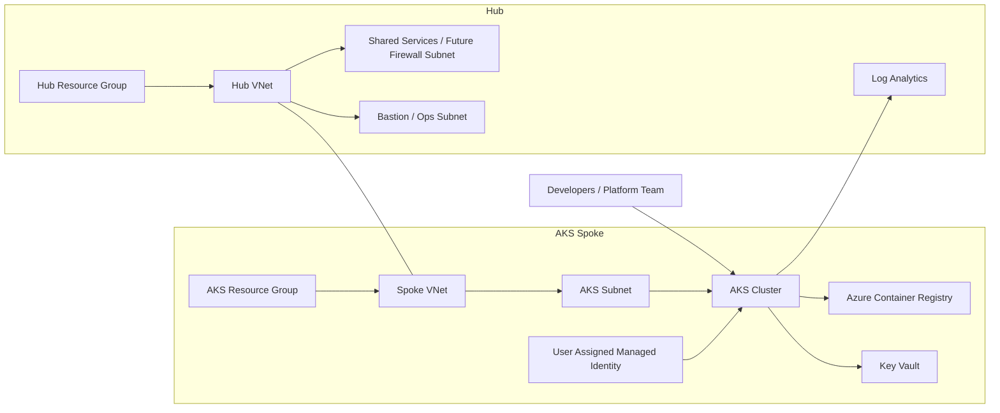

# azure-aks-platform

Production-style Azure AKS landing zone built with Terraform.

This repository is a public, sanitized reference implementation of how I would structure an Azure platform for Kubernetes workloads using:

- Azure hub-spoke networking
- Azure Kubernetes Service
- Azure Container Registry
- Azure Key Vault
- Azure Log Analytics
- user-assigned managed identities
- reusable Terraform modules
- multi-environment layout

No live Azure account details, subscription IDs, tenant IDs, DNS zones or secrets are included.

## What This Repository Demonstrates

- modular Terraform design for Azure
- AKS platform provisioning with reusable building blocks
- network foundation for a hub-spoke model
- identity and secret-management primitives
- operational structure for `dev` and `prod`
- CI/CD validation for Terraform code quality

## Architecture



## Repository Layout

- `modules/resource-group/`: resource group module
- `modules/network/`: VNet, subnets and optional peering
- `modules/acr/`: Azure Container Registry
- `modules/key-vault/`: Key Vault
- `modules/monitoring/`: Log Analytics workspace
- `modules/identity/`: user-assigned managed identity
- `modules/aks/`: AKS cluster
- `envs/dev/`: development environment composition
- `envs/prod/`: production environment composition
- `docs/architecture.md`: design and implementation notes
- `.github/workflows/terraform.yml`: Terraform quality workflow

## Design Goals

- clear separation between foundation and workload platform resources
- reusable modules with environment-specific composition
- minimal hardcoding
- identity-first approach
- safe public sharing

## Modules

### `resource-group`

Creates resource groups with consistent tags.

### `network`

Creates:

- virtual network
- subnets
- optional VNet peering

### `acr`

Creates a private Azure Container Registry with configurable SKU and admin access settings.

### `key-vault`

Creates an Azure Key Vault with RBAC enabled and public access controls.

### `monitoring`

Creates a Log Analytics workspace for AKS and platform observability.

### `identity`

Creates a user-assigned managed identity that can be attached to AKS or supporting services.

### `aks`

Creates:

- AKS cluster
- default node pool
- Azure CNI overlay networking
- OMS / Log Analytics integration
- managed identity integration

## Environments

Two example environments are included:

- `envs/dev`
- `envs/prod`

Each environment is intentionally generic and designed for `terraform init`, `terraform fmt`, `terraform validate` and future extension into real subscriptions.

## CI/CD

GitHub Actions validates the Terraform code with:

- `terraform fmt -check`
- `terraform init -backend=false`
- `terraform validate`

The workflow is safe for a public repository because it does not need cloud credentials.

## How To Use

1. Copy one of the environment folders.
2. Fill in `terraform.tfvars` with your own Azure values.
3. Run:

```bash
cd envs/dev
terraform init
terraform plan
terraform apply
```

## Notes

- This is a reference implementation, not a full enterprise landing zone.
- Add remote state, policy enforcement, private DNS and ingress layers as needed.
- Extend the AKS module with node pool separation, private cluster support and workload identity if you need a more advanced platform.

## Portfolio Positioning

This repository is meant to show cloud platform design quality:

- Azure IaC structure
- platform engineering thinking
- Kubernetes-focused cloud architecture
- reusable and maintainable Terraform layout

